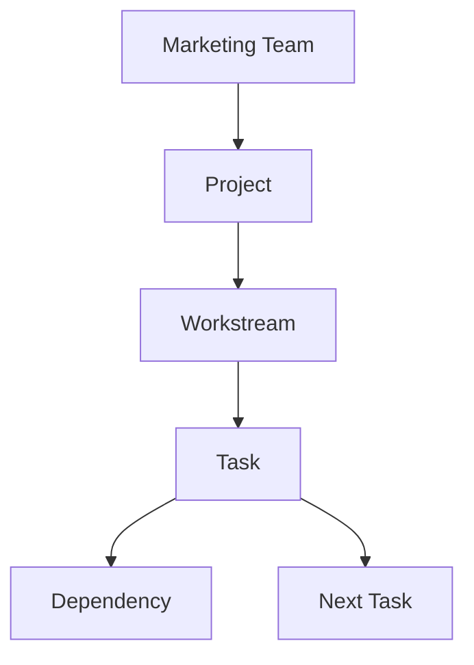
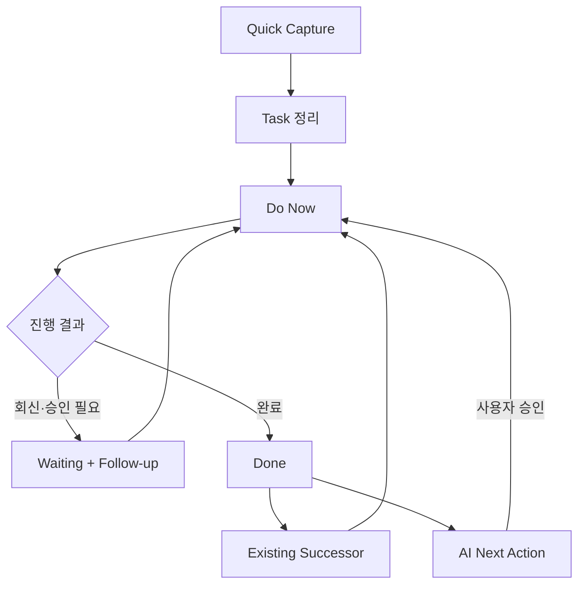
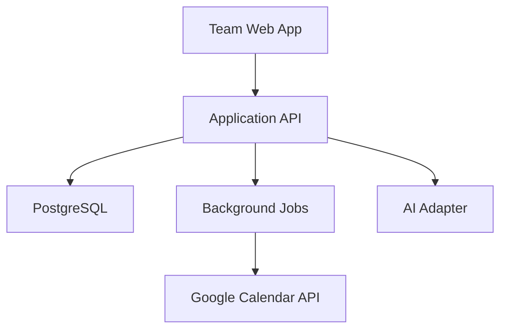

# Marketing Team Workflow — Foundation-first Product Requirements Document v0.3

작성일: 2026-07-25  
문서 성격: 소규모 마케팅팀용 개발 PRD 및 순차 구현 기준  
이전 문서: `marketing-team-workflow-prd-v0.2.md`  
가칭: **Marketing Team Workflow**

---

## 0. 이번 개정의 결론

v0.2의 제품 방향과 정보 구조는 유지한다.

> `Marketing Team → Project → Workstream → Task → Dependency / Next Task`

다만 v0.2에서는 유효한 기능들이 P0에 함께 들어가 있어, 가장 중요한 뼈대를 검증하기 전에 제품이 넓어질 위험이 있었다. v0.3에서는 기능을 삭제하지 않고 다음 원칙으로 구현 순서를 재편한다.

1. **Task와 Workflow가 먼저 실제로 작동해야 한다.**
2. Waiting은 단순 상태가 아니라 Follow-up이 있는 실행 흐름이어야 한다.
3. 완료된 Task는 기존 Successor 또는 사용자가 승인한 Next Action으로 이어져야 한다.
4. 팀원은 별도의 보고 없이 서로의 현재 업무와 정체 지점을 파악할 수 있어야 한다.
5. Google Calendar는 이 핵심 흐름 위에 연결하되, 핵심 업무 데이터의 원장이 되지 않는다.
6. 전략·결정·이해관계자·커뮤니케이션·학습·고급 로딩 기능은 삭제하지 않고 순차적으로 붙인다.

따라서 첫 제품의 우선순위는 아래와 같다.

> **Task → Workflow → Waiting → Next Action → Team Visibility → Calendar**

AI, Context, Decision, Stakeholder, Template, Learning 등의 기능은 이 흐름을 강화하는 방향으로 단계적으로 구현한다.

---

## 1. 제품 정의

### 1.1 한 문장 정의

> 직접 함께 일하는 소규모 마케팅팀이 현재 해야 할 일, 업무의 앞뒤 관계, 대기 사유와 후속 조치를 최소 입력으로 공유하는 팀 워크플로 도구.

### 1.2 초기 사용자

- 한 개 마케팅팀
- 초기 2~6명
- 팀 리드와 직접 함께 일하는 마케터
- 외부 파트너와 내부 유관 부서는 사용자가 아니라 커뮤니케이션 대상

### 1.3 해결하려는 핵심 문제

현재 환경에서는 Google Calendar, Notion, Slack 등에 대한 회사 내 직접 접근 제약으로 인해 다음 정보가 여러 문서와 개인 기억에 흩어진다.

- 누가 무엇을 하고 있는가
- 어떤 업무가 무엇을 기다리고 있는가
- 회신이나 승인이 언제까지 필요한가
- 현재 업무가 끝난 뒤 무엇이 이어지는가
- 어떤 팀원에게 업무가 몰려 있는가
- 프로젝트의 주요 일정이 언제인가

이 제품은 더 많은 정보를 기록하게 만드는 것이 아니라, 이미 존재하는 업무를 최소한으로 구조화하여 **업무가 다음 단계로 넘어가지 못하는 상황을 줄이는 것**을 목표로 한다.

### 1.4 핵심 제품 명제

> 사용자가 제품을 유지하기 위해 들이는 노력보다, 제품이 누락·독촉·상태 공유에 줄여 주는 노력이 더 커야 한다.

이를 위해:

- 새 Task는 제목만으로 생성할 수 있다.
- 상세 필드는 필요해질 때 채운다.
- Waiting 전환처럼 업무 진행에 필수적인 순간에만 추가 입력을 요구한다.
- AI 제안은 사용자가 확인하기 전에는 실제 데이터가 되지 않는다.
- 팀 로딩은 평가 점수가 아니라 배분 판단을 위한 신호로만 사용한다.

---

## 2. 제품이 열었을 때 답해야 하는 질문

사용자는 앱을 연 뒤 10초 안에 다음을 파악할 수 있어야 한다.

1. 내가 지금 해야 할 일은 무엇인가?
2. 팀원들은 지금 무엇을 하고 있는가?
3. 어떤 일이 멈춰 있고, 왜 멈춰 있는가?
4. 누구에게 언제 다시 연락해야 하는가?
5. 이 Task가 끝나면 무엇이 이어지는가?
6. 이번 주 주요 마감과 프로젝트 일정은 무엇인가?
7. 특정 팀원에게 일정이나 업무가 과도하게 몰려 있는가?

이 질문에 직접 답하지 않는 기능은 P0의 전면에 두지 않는다.

---

## 3. 제품 범위와 경계

### 3.1 이 제품이 하는 일

- 팀 공용 Project와 Task 관리
- Workstream별 실행 흐름 정리
- Task 간 선후행 관계 연결
- Waiting 사유와 Follow-up 관리
- 다음 Task 연결 및 AI Next Action 제안
- 팀 전체 현재 업무 가시화
- Google Calendar 일정 읽기와 사용자 승인 후 등록
- 이후 단계에서 Task에 필요한 결정·커뮤니케이션 맥락 연결

### 3.2 이 제품이 아닌 것

- 전사 협업 플랫폼
- 범용 문서 작성 도구
- Slack 대체 메신저
- Jira 수준의 복잡한 이슈 트래커
- CRM
- 외부 파트너용 협업 포털
- 직원 성과평가 또는 감시 시스템
- 자동으로 전략을 결정하는 AI 컨설턴트
- Google Tasks API 기반 서비스

### 3.3 변하지 않는 제약

- AI가 승인 없이 Task, 담당자, 외부 발송, Calendar 일정을 확정하지 않는다.
- 인위적인 프로젝트 진행률 백분율을 사용하지 않는다.
- 초기에는 복잡한 프로젝트별 권한을 만들지 않는다.
- Task 수나 완료량으로 팀원의 성과를 비교하지 않는다.
- 외부 파트너는 초기 버전의 로그인 사용자가 아니다.
- Calendar 연동이 실패해도 핵심 Task 기능은 작동해야 한다.

---

## 4. 핵심 정보 계층



| 레벨 | 정의 | P0 필요 여부 |
|---|---|---:|
| Marketing Team | 직접 함께 일하는 한 개 팀 | 필수 |
| Project | 목적과 기간이 있는 업무 묶음 | 필수 |
| Workstream | 프로젝트 안의 병렬 실행 축 | 필수, 소규모 프로젝트는 생략 가능 |
| Task | 한 명이 책임지고 완료 여부를 판단할 수 있는 일 | 필수 |
| Subtask | 독립 담당자·마감이 필요 없는 체크리스트 | P1 |
| Dependency | Task 시작에 필요한 직접 선행 업무 | 필수 |
| Next Task | 현재 Task 완료 뒤 이어지는 업무 | 필수 |
| Milestone | 여러 Task가 도달해야 하는 중요한 시점 | P0 최소형 |
| Decision | Task를 막거나 여는 결정 | P1 |
| Stakeholder / Communication | 외부·유관 부서와의 요청·회신 맥락 | P1 |
| Learning / Template | 완료 프로젝트의 재사용 정보 | P2 |

### 4.1 구조 사용 원칙

- 실행 중인 Task는 하나의 Project에 속한다.
- Quick Add로 Project가 정해지지 않은 Task는 `Team Inbox`에 임시 저장할 수 있다.
- Workstream은 권장하지만 강제하지 않는다.
- 담당자나 마감이 다르면 하나의 Task 안에 체크리스트로 넣지 않고 Task를 분리한다.
- P0 의존관계는 직접적인 `Finish-to-Start`만 지원한다.
- 순환 의존관계는 허용하지 않는다.
- 한 Task의 직접 선행·후속 관계를 가장 먼저 보여주고, 전체 네트워크 보기는 후순위로 둔다.

---

## 5. 핵심 제품 루프



제품의 가치가 검증되려면 다음 루프가 끊김 없이 작동해야 한다.

1. 제목만으로 Task를 빠르게 입력한다.
2. Project, 담당자, 마감과 필요한 선행 업무를 정리한다.
3. 현재 실행할 Task를 `Do Now`에서 본다.
4. 회신·승인·자료가 필요하면 `Waiting`으로 전환하고 Follow-up 날짜를 잡는다.
5. 완료하면 기존 후속 Task가 활성화된다.
6. 후속 Task가 없으면 AI가 Next Action 후보를 제안한다.
7. 사용자가 승인한 다음 Task가 팀의 실행 목록에 들어간다.
8. 이 변화가 팀 화면과 Calendar에 필요한 수준으로 반영된다.

P0는 이 루프가 실제 팀 업무에서 반복 사용되는지 검증하는 단계다.

---

## 6. P0 상태 모델

v0.2의 9개 상태는 초기 사용 부담을 줄이기 위해 다음 6개 기본 상태로 단순화한다.

| 상태 | 의미 |
|---|---|
| Inbox | 아직 Project나 실행 시점이 정리되지 않은 빠른 입력 |
| To Do | 해야 할 업무로 확정되었으나 아직 시작하지 않음 |
| In Progress | 현재 담당자가 진행 중 |
| Waiting | 회신·승인·자료·선행 업무·문제 해결을 기다림 |
| Review | 내부 검토 또는 최종 확인 필요 |
| Done | 완료 |

`Cancelled`는 일반 상태 탭이 아니라 종료 액션으로 제공한다.

### 6.1 상태에서 분리할 개념

- `Backlog`: 별도 상태가 아니라 시작 예정일이 없거나 Later로 분류된 To Do 필터
- `Ready`: 선행조건이 충족된 To Do의 시스템 필터
- `Blocked`: Waiting의 유형이자 Attention 플래그
- `Overdue`: 상태가 아니라 마감일 기반 경고
- `Needs Follow-up`: Follow-up 날짜 기반 경고

### 6.2 사용자에게 보이는 세 가지 실행 묶음

#### Do Now

- In Progress
- Review
- 선행조건이 충족된 To Do
- 마감 임박 또는 Overdue

#### Waiting

- 외부 회신
- 내부 승인
- 자료 전달
- 선행 Task
- Blocked

#### Coming Next

- 현재 Task가 끝나면 열리는 Successor
- 7일 안에 시작 예정인 To Do
- 사용자가 아직 검토하지 않은 AI Next Action

---

## 7. P0 핵심 요구사항

요구사항 ID는 개발·테스트·이슈 관리에서 공통으로 사용한다.

### 7.1 Task Foundation

| ID | 요구사항 | 우선순위 |
|---|---|---:|
| TASK-01 | 사용자는 제목만으로 Inbox Task를 만들 수 있다. | Must |
| TASK-02 | 실행 Task에는 Project와 Status가 필요하다. | Must |
| TASK-03 | Assignee와 Due date를 빠르게 지정·변경할 수 있다. | Must |
| TASK-04 | Workstream은 선택적으로 연결할 수 있다. | Must |
| TASK-05 | Project, Assignee, Status, Due date로 필터링할 수 있다. | Must |
| TASK-06 | Task 상세는 Project 맥락을 유지하는 우측 패널로 연다. | Must |
| TASK-07 | Task 취소와 복구가 가능하다. | Should |
| TASK-08 | 제목·Project·담당자 중심 통합 검색을 제공한다. | Should |

### 7.2 Workflow와 Dependency

| ID | 요구사항 | 우선순위 |
|---|---|---:|
| FLOW-01 | Task 간 Finish-to-Start 의존관계를 연결할 수 있다. | Must |
| FLOW-02 | 자기 참조와 순환 의존관계를 차단한다. | Must |
| FLOW-03 | 선행 업무가 남은 Task를 시작하려 할 때 경고한다. | Must |
| FLOW-04 | Task에서 직접 선행·현재·후속 흐름을 한 줄로 본다. | Must |
| FLOW-05 | Project Workflow에서 Do Now / Waiting / Coming Next를 구분한다. | Must |
| FLOW-06 | 선행조건이 모두 완료되면 후속 Task를 실행 가능으로 표시하고 Do Now 노출을 제안한다. | Must |
| FLOW-07 | 읽기 쉬운 전체 Flow Map을 제공한다. | P2 |

### 7.3 Waiting과 Follow-up

| ID | 요구사항 | 우선순위 |
|---|---|---:|
| WAIT-01 | Waiting 전환 시 기다리는 내용과 유형을 입력한다. | Must |
| WAIT-02 | 기다리는 상대와 내부 Owner를 지정할 수 있다. | Must |
| WAIT-03 | Follow-up 날짜를 지정한다. | Must |
| WAIT-04 | Follow-up 날짜가 지나면 Needs Attention에 노출한다. | Must |
| WAIT-05 | 회신 후 이어질 Task를 연결할 수 있다. | Must |
| WAIT-06 | Blocked는 Waiting 유형과 경고 플래그로 표시한다. | Must |
| WAIT-07 | Blocked에는 사유와 해결 행동을 기록한다. | Must |

Waiting 유형:

- External Reply
- Internal Approval
- Material / Asset
- Predecessor Task
- Decision
- Blocked
- Other

### 7.4 Next Action

| ID | 요구사항 | 우선순위 |
|---|---|---:|
| NEXT-01 | Done 처리 시 연결된 Successor를 먼저 확인한다. | Must |
| NEXT-02 | 선행조건이 충족된 Successor를 실행 가능으로 표시하고 Do Now 노출을 제안한다. | Must |
| NEXT-03 | Successor가 없으면 AI가 2~4개의 후보를 제안할 수 있다. | Must |
| NEXT-04 | 제안은 이유, 연결 Task, 담당자 후보, 권장 마감, 선행조건을 포함한다. | Must |
| NEXT-05 | 사용자는 수락, 수정 후 수락, 보류, 무시할 수 있다. | Must |
| NEXT-06 | AI 제안은 사용자 승인 전 실제 Task가 되지 않는다. | Must |
| NEXT-07 | 기존 Task와의 중복 가능성을 표시한다. | Should |

### 7.5 Team Visibility

| ID | 요구사항 | 우선순위 |
|---|---|---:|
| TEAM-01 | 팀원별 현재 In Progress 업무를 볼 수 있다. | Must |
| TEAM-02 | 팀원별 이번 주 마감과 Overdue를 볼 수 있다. | Must |
| TEAM-03 | Waiting, Review, 담당자 없는 중요 Task를 볼 수 있다. | Must |
| TEAM-04 | Project별 현재 업무와 정체 지점을 볼 수 있다. | Must |
| TEAM-05 | 팀원별 활성 Task 수와 동시 Project 수를 참고 신호로 표시한다. | Should |
| TEAM-06 | 성과 순위와 정밀 생산성 점수는 제공하지 않는다. | Must |
| TEAM-07 | Effort·회의·조율을 반영한 고급 Team Load는 P2에서 구현한다. | P2 |

### 7.6 Google Calendar

| ID | 요구사항 | 우선순위 |
|---|---|---:|
| CAL-01 | 사용자가 허용한 Google Calendar 일정을 읽는다. | Must |
| CAL-02 | 오늘 일정과 이번 주 주요 일정을 앱에서 본다. | Must |
| CAL-03 | Task 또는 Milestone을 사용자 확인 후 Calendar에 등록한다. | Must |
| CAL-04 | 앱 Entity ID와 Google Event ID를 연결한다. | Must |
| CAL-05 | Calendar 연결 실패가 Task 기능을 막지 않는다. | Must |
| CAL-06 | 다른 팀원의 비공개 일정은 Busy로 표시할 수 있다. | Should |
| CAL-07 | 반복 일정·고급 가용시간 분석은 P2에서 구현한다. | P2 |

---

## 8. P0 화면 구조

### 8.1 최상위 내비게이션

1. **Home**
2. **My Work**
3. **Projects**
4. **Team**
5. **Calendar**

공통 기능:

- `+ Quick Add`
- 검색
- 필요한 최소 알림

P1 이후 보조 메뉴:

- Templates
- Archive
- Settings
- AI Inbox

### 8.2 Home

Home은 팀의 보고용 대시보드가 아니라 오늘의 실행 화면이다.

#### My Focus

- 내가 진행 중인 Task
- 오늘·이번 주 마감
- Review 요청

#### Team in Motion

- 팀원이 현재 In Progress로 둔 Task
- Project 또는 팀원 기준 그룹 전환

#### Needs Attention

- Overdue
- Follow-up 초과
- Blocked
- 담당자 없는 P1 Task

#### Coming Next

- 선행조건이 곧 충족될 Task
- 7일 이내 주요 마일스톤
- 검토가 필요한 Next Action 제안

### 8.3 My Work

기본 섹션:

- Today
- This Week
- In Progress
- Waiting on Others
- Review Requested
- Later

빠른 조작:

- 상태 변경
- Due date 변경
- Waiting 전환과 Follow-up 지정
- Review 요청
- Next Task 연결
- Calendar 등록

### 8.4 Projects

각 Project에 다음을 표시한다.

- Project 이름
- Project Lead
- 현재 주요 Workstream
- 다음 Milestone
- In Progress 수
- Waiting / Attention 수
- 목표 일정

P0에서는 복잡한 Project Health 산식이나 진행률 백분율을 사용하지 않는다.

### 8.5 Project Workspace

P0 탭:

1. **Workflow** — 기본 탭
2. **Tasks**
3. **Milestones**

P1 추가 탭:

4. **Context**
5. **Activity**

Workflow 화면:

- Do Now
- Waiting
- Coming Next
- Workstream별 현재 Task
- 직접 Dependency
- `Predecessor → Current → Successor` Flow Strip
- Review
- 다음 Milestone

### 8.6 Task Detail Panel

P0:

- Title / Description
- Project / Workstream
- Assignee / Due date
- Status
- Waiting 전용 필드
- 직접 Predecessor / Successor
- Next Action
- Calendar 연결

P1:

- Checklist
- Priority / Effort
- Comment / @mention
- Related Decision
- Stakeholder / Communication
- Activity

### 8.7 Team

P0는 다음 2주의 단순 가시성에 집중한다.

- 팀원별 In Progress
- 이번 주 Due
- Overdue
- Waiting / Review
- 담당 Project 수
- Google Calendar 회의 시간

정밀 부하 점수와 자동 재배분 제안은 P2로 둔다.

### 8.8 Calendar

- Google Calendar 일정
- 앱의 Milestone
- Calendar에 등록된 Task time block
- Project / Member 필터
- 연결 상태와 마지막 동기화 시간

---

## 9. Quick Add

### 9.1 최소 입력

- 제목 입력 후 Enter: Inbox Task 생성
- Project, 담당자, 마감은 이후 빠르게 보완
- 자연어 입력과 빠른 명령은 선택 기능

지원 예:

- `@이름`: 담당자
- `#프로젝트`: Project
- `/금요일`: Due date

### 9.2 P0 AI 구조화

입력 예:

> 오라리 HQ에 디지털 광고 문구 수정안 금요일까지 보내고 시딩 금지 예외 없는지 확인

제안 예:

- Project: AURALEE Launch
- Task 1: 디지털 광고 문구 수정안 작성
- Task 2: HQ에 수정안 전달
- Dependency: Task 1 → Task 2
- Waiting: 시딩 금지 예외 여부 회신
- Follow-up 날짜

P0에서는 한 줄 입력 구조화와 Next Action만 AI 기능으로 구현한다. 회의록·이메일 전문에서 Decision·Stakeholder·Communication을 추출하는 기능은 P1로 둔다.

---

## 10. AI 행동 규칙

### 10.1 P0 역할

- 한 줄 입력을 Task 후보로 구조화
- 큰 Task의 분해 제안
- 완료 후 Next Action 후보 제안
- 기존 Task와 중복 가능성 경고

### 10.2 P0에서 하지 않는 일

- 자동 담당자 변경
- 자동 마감 확정
- 승인 없는 Task 생성
- 자동 Calendar 등록
- 외부 메시지나 이메일 발송
- 전략적 방향 자동 결정

### 10.3 제안 출력 최소 구조

```text
title
reason
source_task_id
suggested_project_id
suggested_workstream_id
suggested_assignee_id
suggested_due_date
suggested_predecessor_ids
confidence
```

### 10.4 제안 품질 원칙

- 한 번에 2~4개만 제안한다.
- 이미 확정된 Project 정보와 Task 흐름을 일반 체크리스트보다 우선한다.
- 담당자·마감 추정은 추정임을 표시한다.
- 반복적으로 거절된 유형은 빈도를 낮춘다.
- 제안 근거를 한 문장으로 설명한다.
- AI를 사용할 수 없는 경우에도 수동 Successor 연결은 완전히 작동해야 한다.

---

## 11. Google Calendar Integration

업무·의존관계·상태·후속 업무는 자체 데이터베이스에서 관리한다. Google Calendar는 외부 일정 소스이자 선택적 출력 채널이다.

### 11.1 읽기

- 사용자가 선택한 Calendar의 일정 표시
- Home과 Calendar 화면에 오늘·이번 주 일정 반영
- Team 화면에 회의 시간 합계 반영
- 다른 팀원의 상세 일정은 선택적으로 Busy 처리
- 증분 동기화와 마지막 동기화 시각 표시

### 11.2 등록

Task 또는 Milestone에서 `Add to Calendar` 선택:

1. 제목, 시작·종료 시간 확인
2. 대상 Calendar 확인
3. 필요 시 참석자 확인
4. 사용자 승인
5. 이벤트 생성
6. 앱 Entity와 Google Event 연결

### 11.3 실패 처리

- OAuth 미승인과 동기화 오류를 구분해 표시한다.
- 회사 Workspace 정책으로 차단된 경우 이를 명확히 알린다.
- Calendar 연결이 없어도 Project와 Task 기능은 모두 사용할 수 있다.
- API 접근은 회사 정책 우회를 전제로 하지 않는다.

---

## 12. 권한과 협업

### 12.1 P0 권한

| 역할 | 권한 |
|---|---|
| Team Admin | 팀원 관리, 설정, Project 삭제·복구 |
| Team Member | 팀의 모든 Project와 Task 조회·생성·수정 |
| Project Lead | 별도 권한 등급이 아니라 Project 책임 역할 |

### 12.2 원칙

- 기본적으로 팀의 활성 Project는 모든 팀원에게 보인다.
- 개인 초안과 제한 공개는 P1의 `Private Draft`에서 검토한다.
- 외부 관계자는 P0에서 계정을 갖지 않는다.
- 복잡한 Project별 View/Edit 권한은 여러 팀 확장 시점까지 만들지 않는다.

---

## 13. P0 최소 데이터 모델

### 13.1 엔티티

```text
Workspace
 ├─ Member
 ├─ Project
 │   ├─ Workstream
 │   │   └─ Task
 │   │       └─ TaskDependency
 │   └─ Milestone
 ├─ AISuggestion
 ├─ CalendarConnection
 │   └─ CalendarEventLink
 └─ ActivityLog
```

P1에서 추가:

```text
TaskComment
Decision
Stakeholder
Communication
ProjectUpdate
Notification
PrivateDraft
```

P2에서 추가:

```text
ProjectLearning
Template
RecurringTaskRule
Attachment
AdvancedLoadSnapshot
```

### 13.2 Task

```text
id
workspace_id
project_id nullable only while status = Inbox
workstream_id nullable
title
description nullable
status
assignee_id nullable
reviewer_id nullable
start_date nullable
due_date nullable
waiting_type nullable
waiting_on_text nullable
waiting_owner_member_id nullable
follow_up_at nullable
blocked_reason nullable
blocked_resolution_action nullable
created_by
created_at
updated_at
completed_at nullable
cancelled_at nullable
```

### 13.3 TaskDependency

```text
id
predecessor_task_id
successor_task_id
dependency_type = finish_to_start
created_at
```

검증:

- 자기 자신과 연결 금지
- 순환 연결 금지
- 다른 Workspace 연결 금지
- 다른 Project 연결 시 경고
- 선행 업무가 남은 Task 시작 시 경고

### 13.4 Project

```text
id
workspace_id
name
one_line_objective nullable
project_lead_id
target_start_date nullable
target_end_date nullable
created_at
updated_at
archived_at nullable
```

P1에서 `phase`, `health`, `brief`, `success_criteria`, `key_constraint`를 확장한다.

### 13.5 AISuggestion

```text
id
workspace_id
project_id nullable
source_task_id nullable
suggestion_type
payload_json
reason
confidence nullable
status
reviewed_by nullable
reviewed_at nullable
created_at
```

`status`:

- Pending
- Accepted
- EditedAndAccepted
- Deferred
- Dismissed

---

## 14. P0 구현 순서와 통과 게이트

P0는 하나의 대형 개발 묶음이 아니라, 아래 순서로 쌓는다. 앞 단계의 Acceptance Criteria를 충족하기 전에 뒤 단계 기능을 넓히지 않는다.

### P0-A — UX Skeleton

목적: 실제 업무가 어떤 밀도로 보이는지 검증한다.

구현:

- Home
- My Work
- Projects
- Project Workflow
- Task Detail Panel
- Team
- Calendar
- Quick Add
- 현실적인 Mock Data 3개 Project

통과 조건:

- 사용자가 10초 안에 My Focus, Waiting, Coming Next를 찾는다.
- Project → Workstream → Task 계층이 설명 없이 이해된다.
- Task 상세를 열어도 Project 맥락이 유지된다.

### P0-B — Persistent Task Core

목적: 제품의 업무 원장을 만든다.

구현:

- Authentication
- Workspace / Member
- Project / Workstream / Task CRUD
- 6개 Task 상태
- Assignee / Due date
- Team Inbox
- 검색과 기본 필터

통과 조건:

- 제목만으로 Task를 생성할 수 있다.
- 담당자·상태·마감 변경이 2회 이내 조작으로 끝난다.
- 새로고침과 재로그인 후 데이터가 유지된다.
- 팀원의 변경이 다른 팀원 화면에 반영된다.

### P0-C — Workflow Core

목적: 독립된 체크박스를 연결된 업무 흐름으로 만든다.

구현:

- Finish-to-Start Dependency
- 순환 방지
- 선행조건 경고
- Predecessor → Current → Successor Flow Strip
- Do Now / Waiting / Coming Next 계산

통과 조건:

- 선행 Task가 끝나면 후속 Task의 실행 가능 여부가 바뀐다.
- 사용자는 어떤 Task가 다음 Task를 막는지 확인할 수 있다.
- 복잡한 전체 Flow Map 없이도 직접 앞뒤 관계를 이해할 수 있다.

### P0-D — Waiting and Follow-up

목적: 정체된 업무가 잊히지 않도록 한다.

구현:

- Waiting 유형
- 기다리는 내용·상대·내부 Owner
- Follow-up 날짜
- Needs Attention
- Blocked 유형과 해결 행동

통과 조건:

- Waiting Task에 다음 확인 시점이 존재한다.
- Follow-up 초과 업무가 Home에 자동 노출된다.
- 단순 회신 대기와 실제 Blocked를 구분할 수 있다.

### P0-E — Team Visibility

목적: 별도 보고 없이 현재 팀 업무를 공유한다.

구현:

- Team in Motion
- 팀원별 In Progress / Due / Waiting / Review
- Project별 Attention
- 활성 Task 수와 동시 Project 수
- 기본 Activity Log

통과 조건:

- 팀 리드가 누가 무엇을 하는지 한 화면에서 파악한다.
- 새 업무를 배정하기 전에 팀원의 2주 업무 집중도를 확인한다.
- 화면이 성과 순위처럼 보이지 않는다.

### P0-F — AI Next Action

목적: Task 완료 후 다음 일이 끊기는 문제를 줄인다.

구현:

- Quick Add parsing
- 큰 Task 분해 제안
- Done 후 Next Action
- Suggestion Review UI
- 중복 가능성 경고

통과 조건:

- 기존 Successor가 AI 제안보다 우선한다.
- Successor가 없을 때만 2~4개의 후보가 나타난다.
- 모든 AI 결과는 승인 전 Pending이다.
- AI 장애 시에도 수동 Workflow가 작동한다.

### P0-G — Google Calendar

목적: 업무와 실제 시간 계획을 연결한다.

구현:

- Google OAuth
- Calendar read
- Home / Calendar 표시
- Task / Milestone 등록
- Event mapping
- 연결·동기화 오류 처리

통과 조건:

- 사용자가 선택한 Calendar 일정이 앱에 표시된다.
- 사용자 승인 없이 이벤트가 생성되지 않는다.
- Calendar 연결 해제 후에도 Task 데이터는 보존된다.
- 회사 정책 차단과 일반 오류를 구분해 안내한다.

### P0-H — Pilot Hardening

목적: 2~6명 팀의 실제 사용 가능성을 검증한다.

구현:

- 핵심 알림
- 성능·오류 처리
- 모바일 기본 동작
- 데이터 백업·복구
- 온보딩

파일럿:

- 활성 Project 3~5개
- 2주 사용
- 입력 부담, 상태 혼동, 누락, AI 제안 품질, Calendar 연결 성공 여부 기록

P0 완료 조건:

- 팀원이 별도 독촉 없이 주 3일 이상 제품을 연다.
- 활성 Project의 Task 상태가 2주 후에도 80% 이상 최신이다.
- 주간 업무 공유 준비 시간이 기존 대비 감소한다.
- Waiting에 Follow-up이 없는 비율이 지속적으로 감소한다.
- “다음에 무엇을 해야 하는지” 확인하기 위한 별도 대화가 감소한다.

---

## 15. P1 — 실행 맥락 강화

P0 루프가 실제로 사용된다는 것이 확인된 뒤, 사용자의 실제 마케팅 업무에서 반복적으로 필요한 맥락을 Task에 붙인다.

### 15.1 Project Context

- 한 줄 목적
- Background / Why now
- Success Criteria
- Key Constraint
- 현재 Phase
- Project Health
- 다음 Milestone

모든 필드를 강제하지 않고 접힌 보조 정보로 제공한다.

### 15.2 Decision

- 질문
- 선택지
- 추천안
- Decision Owner
- 협의 대상
- 결정 시한
- 최종 결정
- 영향받는 Task

브랜드/HQ 가이드의 표현 강도:

- Prohibited
- Approval Required
- Consultation Required
- Recommended
- Flexible

Decision은 독립 전략 시스템이 아니라 Task를 막거나 여는 최소 결정 게이트로 구현한다.

### 15.3 Stakeholder / Communication

- Stakeholder
- 내부 Owner
- 요청사항
- 상대의 약속
- 회신 필요일
- Follow-up 날짜
- 연결 Task

CRM형 관계 이력을 만들지 않고, Task가 멈추지 않게 하는 운영 정보만 기록한다.

### 15.4 AI Parsing 확장

- 회의록 붙여넣기
- 이메일 본문 붙여넣기
- Task / Decision / Follow-up 후보 추출
- 사용자가 검토한 뒤 저장

### 15.5 협업 보조

- Comment / @mention
- Review 요청 고도화
- Project Update
- 일일·주간 Digest
- 핵심 알림
- Private Draft
- 파일 첨부
- 반응형 모바일 고도화

### 15.6 Template 초안

- Brand / Seasonal Strategy
- Brand Launch / HQ Alignment
- Collaboration / Pop-up / Cultural Project
- Partnership Proposal
- Fashion Week / Media / Influencer

P1에서는 기본 Workstream과 초기 Task를 불러오되, 사용자가 쉽게 삭제·수정할 수 있어야 한다.

---

## 16. P2 — 운영 최적화와 학습

P2는 데이터가 충분히 쌓이고 P0·P1 사용 패턴이 검증된 뒤 구현한다.

### 16.1 Advanced Team Load

- Effort: XS / S / M / L / XL
- Committed / Tentative
- 마감 집중도
- 회의 시간
- Review와 Follow-up
- 동시 Project 수
- Light / Balanced / Heavy / Overloaded 범위
- 사용자 승인 기반 재배분 제안

정확한 생산성 수치나 평가 점수처럼 보이지 않게 한다.

### 16.2 Project Learning

- 종료 요약
- 잘된 점
- 반복하지 않을 점
- 다음 프로젝트에 재사용할 Task / Workstream
- Reference 링크
- 완료 Project의 Template 저장

### 16.3 Workflow 고도화

- 읽기 쉬운 전체 Flow Map
- 고급 Timeline / Gantt
- 반복 Task
- 더 다양한 Dependency 유형
- Project 주간 AI 브리핑
- 마일스톤 누락 점검
- 고급 Calendar 가용시간 분석

### 16.4 운영 기능

- 예산·비용 관리
- Archive와 복원 고도화
- 데이터 Export
- 첨부파일 관리
- Notification 설정 고도화

---

## 17. P3 — 조직과 채널 확장

P3는 초기 팀 내부 제품의 성공 이후에만 검토한다.

- 여러 팀 또는 전사 Workspace
- 복잡한 권한 모델
- 외부 파트너 제한 계정
- 이메일 직접 연동
- Slack / Teams 연동
- 모바일 네이티브 앱
- 조직 단위 Capacity Planning

이 단계의 기능은 현재 제품의 필수 약속이 아니라, P0~P2 데이터와 사용 요구를 근거로 재평가한다.

---

## 18. v0.2 기능 보존·이관표

아래 표는 기존 개발 목표가 삭제되지 않고 어느 단계로 이동했는지 보여준다.

| v0.2 기능 | v0.3 단계 | 처리 |
|---|---|---|
| Project → Workstream → Task | P0-B | 핵심 뼈대 유지 |
| Team Inbox / Quick Add | P0-B | 유지 |
| 9개 Task 상태 | P0-B | 6개로 단순화, 개념은 필터·플래그로 보존 |
| Dependency / Task Flow Strip | P0-C | 핵심으로 상향 |
| Do Now / Waiting / Coming Next | P0-C | 핵심으로 상향 |
| Waiting Follow-up | P0-D | 핵심으로 상향 |
| Blocked reason | P0-D | Waiting 유형·경고로 단순화 |
| Home / My Work / Projects | P0-A~B | 유지 |
| Project Workflow | P0-A~C | 기본 화면 유지 |
| Task List | P0-B | 기본 실행 보기로 유지 |
| Task Board | P1 | List 사용성 검증 후 추가 |
| Subtask / Checklist | P1 | 독립 Task와의 혼동을 줄인 뒤 추가 |
| Priority / Effort | P1 | 기본 배정·마감 흐름 검증 후 추가 |
| Milestone | P0-A~B | 최소 일정 객체로 유지 |
| Search / Filter | P0-B | 기본 범위로 유지 |
| Activity Log | P0-E | 핵심 변경만 먼저 기록 |
| Notification | P0-H~P1 | 파일럿 필수 알림부터 순차 추가 |
| Team 기본 화면 | P0-E | 핵심 가시성으로 유지 |
| Team Load 산식 | P2 | 삭제하지 않고 데이터 축적 후 구현 |
| AI Quick Add | P0-F | 범위를 좁혀 구현 |
| AI Next Action | P0-F | 핵심으로 유지 |
| 회의록·이메일 추출 | P1 | Context 엔티티와 함께 구현 |
| AI 팀 브리핑 | P2 | 후순위 |
| Google Calendar 읽기·등록 | P0-G | 핵심 연동으로 유지 |
| Project Brief / Strategic Spine | P1 | 축약 Context로 유지 |
| Project Phase / Health | P1 | 기본 Task 루프 이후 구현 |
| Decision / Approval | P1 | Task 연결형 보조 기능으로 유지 |
| Stakeholder / Communication | P1 | CRM이 아닌 Follow-up 보조로 유지 |
| Comment / @mention | P1 | 기본 Activity 검증 후 구현 |
| Project Update / Digest | P1 | 유지 |
| Private Draft | P1 | 유지 |
| 파일 첨부 | P1 | 유지 |
| Templates | P1 | 초기 데이터가 쌓인 뒤 구현 |
| Project Learning | P2 | 유지 |
| 전체 Flow Map | P2 | 직접 Flow Strip 검증 후 구현 |
| 고급 Timeline / Gantt | P2 | 유지 |
| 반복 Task | P2 | 유지 |
| 예산·비용 | P2 | 유지 |
| 이메일 직접 연동 | P3 | 장기 확장 |
| 외부 파트너 계정 | P3 | 장기 확장 |
| Slack / Teams | P3 | 장기 확장 |
| 여러 팀 / 전사 Workspace | P3 | 장기 확장 |
| 네이티브 모바일 앱 | P3 | 반응형 웹 검증 후 검토 |

---

## 19. 성공 지표

### 19.1 North Star

> 팀원이 별도 독촉 없이 제품을 열고, 실제 업무를 다음 단계로 움직이기 위해 Task를 업데이트하는가?

### 19.2 사용성

- 새 Task 생성 중앙값 10초 이하
- 상태 변경 5초 이하
- Waiting 전환과 Follow-up 설정 15초 이하
- 팀원이 주 3일 이상 자발적으로 사용
- 활성 Project의 최신 상태 유지율 80% 이상

### 19.3 업무 효과

- 담당자 없는 중요 Task 감소
- Follow-up이 없는 Waiting 감소
- 마감 직전 발견되는 Blocker 감소
- 다음 Task 확인을 위한 별도 회의·메시지 감소
- 팀원별 프로젝트 상태 해석 차이 감소

### 19.4 AI 품질

- Next Action 수락 또는 수정 후 수락 비율
- 중복 Task 제안 비율
- 잘못 추정한 담당자·마감 비율
- 제안 검토에 걸리는 시간
- AI Inbox 미처리 누적량

### 19.5 실패 신호

- Task보다 Context 작성에 더 많은 시간이 든다.
- 팀원이 업데이트를 위해 별도 회의를 해야 한다.
- Waiting에 Follow-up 날짜가 계속 비어 있다.
- Team 화면이 성과 평가로 받아들여진다.
- AI 제안이 실무와 무관한 일반 체크리스트로 쌓인다.
- Calendar 연결 문제 때문에 핵심 Task 기능을 사용하지 못한다.

---

## 20. 권장 기술 구조

### 20.1 애플리케이션

- Frontend / Backend: Next.js + TypeScript
- UI: Tailwind CSS + 접근성 있는 컴포넌트 시스템
- Database: PostgreSQL
- ORM: Prisma 또는 Drizzle
- Authentication: 앱 로그인과 Google Calendar OAuth 분리
- Background Jobs: Calendar sync, Follow-up reminder, AI parsing
- AI: 서버 사이드 Adapter 구조

### 20.2 시스템 원칙

- PostgreSQL이 업무 데이터의 원장이다.
- Google Calendar는 외부 일정 소스이자 선택적 출력 채널이다.
- AI는 실제 Entity가 아니라 `AISuggestion`을 생성한다.
- 사용자가 승인한 제안만 실제 Task로 변환한다.
- 주요 상태·담당자·마감 변경은 Activity Log에 남긴다.
- P1·P2 확장을 위해 엔티티 연결 여지는 두되, 사용하지 않는 테이블을 P0에 미리 과도하게 만들지 않는다.



---

## 21. UX 원칙

### 21.1 Task-first

- Home 상단은 My Focus다.
- Project 기본 탭은 Workflow다.
- 차트보다 실행 가능한 Task를 먼저 보여준다.
- Context는 필요할 때 펼친다.

### 21.2 최소 조작

다음 행동은 1~2번의 클릭으로 끝나야 한다.

- Task 완료
- 담당자 변경
- 마감 변경
- Waiting 전환
- Follow-up 지정
- Review 요청
- Successor 연결

### 21.3 점진적 상세 공개

- 카드에는 제목, 담당자, 상태, 마감, 정체 신호만 표시한다.
- 상세 정보는 우측 패널에서 본다.
- 전체 Flow Map과 고급 Timeline은 기본 화면에 두지 않는다.

### 21.4 시각 방향

- 패션회사에 어울리는 차분하고 편집적인 인상
- 높은 가독성과 적절한 정보 밀도
- 흰색과 중립색 중심
- 상태 색상은 절제
- 과도한 카드, 차트, 그라데이션, 게임화 금지
- 스프레드시트처럼 보이지 않되 한 화면에서 충분한 업무를 본다.

---

## 22. 샘플 프로젝트

### Project A — AURALEE Launch Alignment

- Workstream: HQ Alignment / Marketing Guideline / Launch Planning
- Do Now: 디지털 광고 문구 수정안 작성
- Waiting: HQ의 시딩 정책 회신
- Follow-up: 회신 필요일 다음 영업일
- Coming Next: 최종 문서 반영 → 내부 공유 → 런칭 플랜 수정

### Project B — Cultural Collaboration

- Workstream: Concept / Creative / Production / PR / Operation
- Critical Flow: Creative approval → Production → Installation → Live
- Waiting / Blocked: Venue production scope 미확정
- Next Milestone: Creative freeze

### Project C — Brand Strategy Presentation

- Workstream: Analysis / Strategic Narrative / Execution / Deck / Script
- Waiting: 회사가 기대하는 플래그십 역할의 우선순위
- Do Now: 회사에 던질 핵심 질문 정리
- Coming Next: 시나리오 비교 → Recommendation → Deck

---

## 23. 개발 완료 정의

기능은 화면이 존재한다고 완료되지 않는다. 각 P0 기능은 다음을 모두 충족해야 한다.

- 요구사항 ID에 연결되어 있다.
- 정상 흐름과 오류 흐름이 구현되어 있다.
- 빈 상태, 로딩 상태, 권한 오류가 처리되어 있다.
- 모바일 기본 동작이 확인되었다.
- 핵심 행동에 대한 테스트가 있다.
- 다른 팀원의 변경이 일관되게 반영된다.
- Activity Log가 필요한 변경을 기록한다.
- AI나 Calendar 장애가 핵심 Task 흐름을 막지 않는다.

P1 개발은 P0 핵심 루프가 파일럿에서 반복 사용된 이후 시작한다. 단, P1 확장을 막는 구조적 결정은 P0 데이터 모델과 API 설계에서 미리 고려한다.

---

## 24. 보안과 회사 환경

개발 전 확인:

- 회사 PC에서 배포 도메인 접속 가능 여부
- Google OAuth와 `googleapis.com` 접근 가능 여부
- 회사 계정 Calendar scope 허용 여부
- 회사 프로젝트 정보의 외부 클라우드 저장 허용 범위
- 외부 LLM API로 전송할 수 있는 정보 범위
- 데이터 보존·삭제 정책

필수 원칙:

- Google refresh token 암호화
- 최소 OAuth scope
- Workspace 단위 접근 통제
- Calendar 세부 일정 기본 비공개 옵션
- 외부 AI 전송 전 민감정보 처리 정책
- 주요 변경 기록
- 삭제 항목의 복구 가능성

---

## 25. 구현 전에 확정할 최소 결정

P0-A 프로토타입은 다음을 합리적으로 가정해 시작할 수 있다.

- 초기 팀원: 2~6명
- 한 Workspace
- 팀의 활성 Project는 모두 공개
- 외부 관계자는 로그인하지 않음
- Google Tasks API는 사용하지 않음

P0-B 착수 전 확정:

1. 로그인 방식
2. 초기 팀원 수와 역할
3. 평균 활성 Project 수
4. 팀에서 실제 사용하는 대표 Workstream 명칭

P0-F 착수 전 확정:

5. 외부 AI API로 전송 가능한 프로젝트 정보 범위
6. AI 로그와 원문 보존 정책

P0-G 착수 전 확인:

7. 회사 Google Workspace의 OAuth 허용 범위
8. 배포 환경에서 Calendar API 접근 가능 여부

P1 이후 실제 사용 데이터를 보고 결정:

- Project Brief의 적정 필드
- Decision과 Communication의 상세 수준
- Private Draft 필요성
- Template의 기본 Workstream
- Team Load 가중치
- 전체 Flow Map과 Timeline의 우선순위

---

## 26. 공식 Calendar 참고 자료

- 이벤트 생성: https://developers.google.com/workspace/calendar/api/guides/create-events
- 이벤트 조회·동기화: https://developers.google.com/workspace/calendar/api/v3/reference/events/list
- OAuth scopes: https://developers.google.com/workspace/calendar/api/auth
- Google Workspace 앱 접근 제어: https://knowledge.workspace.google.com/admin/apps/control-which-apps-access-google-workspace-data

---

## 27. 최종 제품 판단

이 제품의 뼈대는 풍부한 전략 데이터나 정교한 대시보드가 아니다.

> **한 Task가 왜 멈췄는지, 언제 다시 움직여야 하는지, 끝난 뒤 무엇이 이어지는지를 팀 전체가 공유하는 것**

P0는 이 뼈대를 완성한다. P1은 실제 마케팅 업무에 필요한 결정과 커뮤니케이션 맥락을 붙이고, P2는 누적된 데이터를 바탕으로 팀 운영과 학습을 고도화한다. P3는 제품이 한 팀에서 충분히 유용하다는 것이 확인된 뒤 조직과 외부 채널로 확장한다.

따라서 v0.3의 개발 원칙은 다음 한 문장으로 요약된다.

> **기능을 덜 만들자는 것이 아니라, Task와 Workflow가 먼저 실제로 작동하게 만든 뒤 필요한 기능을 올바른 순서로 붙인다.**
